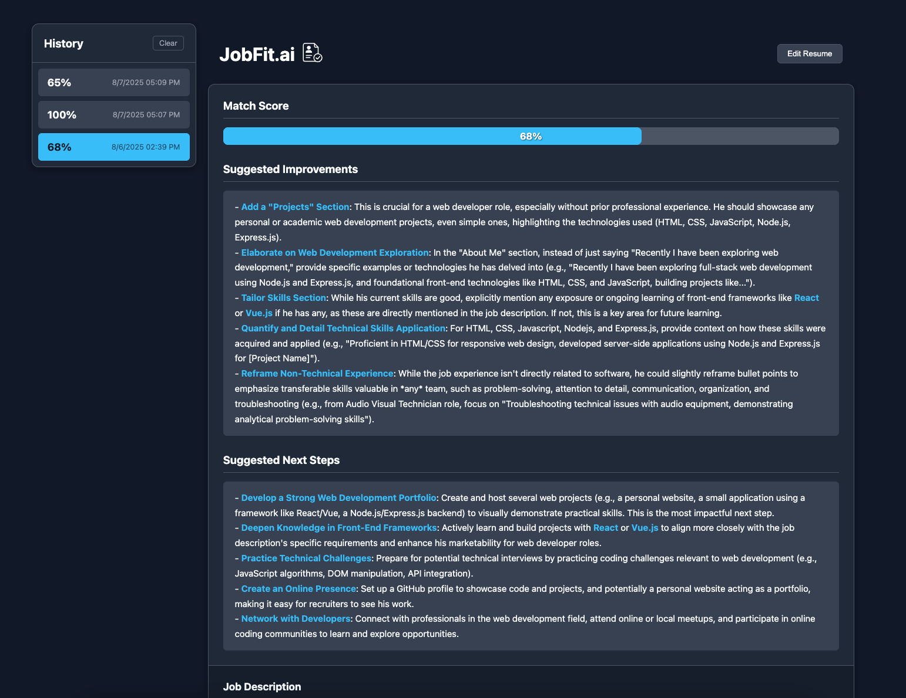

# JobFit.ai - AI-Powered Resume Analyzer


An intelligent web application that analyzes your resume against a job description, providing an instant match score and actionable feedback powered by the Google Gemini API.

**[➡️ View the Live Demo](https://www.job-fit-ai.com/)**

---




## About The Project

The modern job search can feel like sending applications into a black hole. It's often impossible to know how well your resume aligns with a role or why you didn't get a response. **JobFit.ai** was built to solve this problem.

This tool acts as an instant AI-powered career coach, giving you immediate, data-driven feedback. By pasting your resume and a target job description, you can quickly understand your strengths, identify areas for improvement, and tailor your application to perfectly match what recruiters are looking for.

### Key Features

-   **🤖 AI Match Score:** Get an instant percentage score on how well your resume fits a job description.
-   **📝 Actionable Feedback:** Receive concrete suggestions for improvements and next steps, generated by Google Gemini.
-   **💾 Session History:** Your past analyses are saved in your browser's local storage, allowing you to track improvements and compare results.
-   **🔒 Secure & Private:** All analysis happens on the server; your data is not stored permanently. A robust IP-based rate limiter prevents API abuse.
-   **📱 Fully Responsive:** A clean, mobile-first design that works beautifully on any device.
-   **✨ Modern UI:** A polished, professional interface with a dynamic history panel and interactive elements.

## Tech Stack

This project was built from the ground up as a full-stack application, demonstrating a wide range of modern web technologies.

| Category      | Technology                                                                                                    |
| ------------- | ------------------------------------------------------------------------------------------------------------- |
| **Backend**   | **Go (Golang)** - For a high-performance, concurrent, and statically-typed API server.                          |
| **Frontend**  | **HTML5, CSS3, Vanilla JavaScript** - No frameworks, just clean, efficient, and standard web technologies.       |
| **AI Engine** | **Google Gemini 2.0 Flash API** - For fast, cost-effective, and high-quality text generation and analysis.      |
| **Database**  | **Redis** - For a fast, in-memory data store to power the secure, IP-based rate limiting system.                |
| **Deployment**| **Render** - A cloud platform hosting both the Go Web Service and the private Redis instance.                   |

## Getting Started

To get a local copy up and running, follow these simple steps.

### Prerequisites

You will need the following software installed on your machine:
-   [Go](https://go.dev/doc/install) (version 1.21 or newer)
-   [Docker](https://www.docker.com/products/docker-desktop/) (the easiest way to run Redis locally)
-   A Google Cloud Platform account with the Vertex AI API enabled to get credentials.

### Installation & Setup

1.  **Clone the repository:**
    ```sh
    git clone https://github.com/ethandillon/JobFit.ai
    cd JobFit.ai
    ```

2.  **Start a local Redis instance:**
    ```sh
    docker run --name my-redis -p 6379:6379 -d redis
    ```

3.  **Set up environment variables:**
    Create a `.env` file in the root of the project by copying the example file:
    ```sh
    cp .env.example .env
    ```
    Now, open the `.env` file and add your credentials. You can use either a Service Account (recommended) or an API Key.

    **Using a Service Account (Recommended):**
    ```env
    # .env file

    # Path to your downloaded Google Cloud service account JSON file
    GOOGLE_APPLICATION_CREDENTIALS=./path-to-your-credentials.json

    # Local Redis server address
    REDIS_ADDR=localhost:6379
    REDIS_PASSWORD=""
    ```

    **Using an API Key:**
    ```env
    # .env file

    # Your Gemini API Key
    GEMINI_API_KEY=AIzaSy...

    # Local Redis server address
    REDIS_ADDR=localhost:6379
    REDIS_PASSWORD=""
    ```

4.  **Install Go dependencies:**
    ```sh
    go mod tidy
    ```

### Running the Application

1.  **Start the server:**
    ```sh
    go run main.go
    ```
2.  Open your browser and navigate to `http://localhost:8080`.

## Deployment

This application is deployed on [Render](https://render.com/) and configured for continuous deployment from the `main` branch. The infrastructure consists of:
-   A **Go Web Service** that compiles and runs the `main.go` binary.
-   A **Private Redis Instance** for rate limiting, connected via Render's internal network.
-   Environment variables and secret files are managed securely through the Render dashboard.

## License

Distributed under the MIT License. See `LICENSE` for more information.

## Future Improvements

-   [ ] **User Accounts:** Allow users to create accounts to save their resume and have a persistent, cross-device history.
-   [ ] **Tone & Language Analysis:** Add a feature to analyze the tone (e.g., professional, confident) of the resume's summary.
-   [ ] **Export to PDF:** Allow users to export their updated resume suggestions or a summary of the analysis.

## Contact

Ethan Dillon - [@LinkedIn](https://www.linkedin.com/in/ethan-dillon-115b64294/) - ethanbradforddillon@gmail.com

Project Link: [https://github.com/ethandillon/JobFit.ai](https://github.com/ethandillon/JobFit.ai)